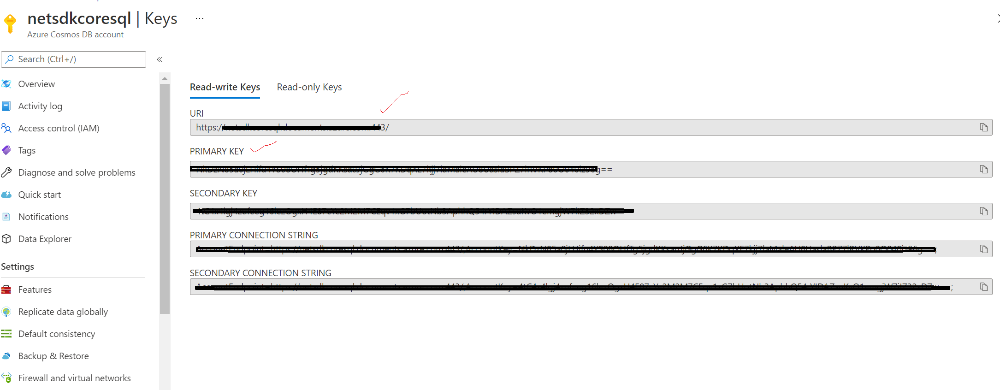
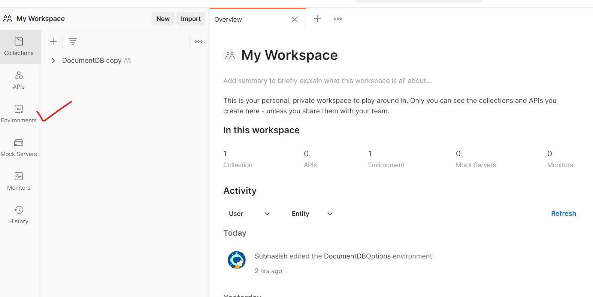

# Microsoft Azure Cosmos DB REST APIs Postman Guide
Step-by-step guidance for testing Azure Cosmos DB resources using REST APIs with [Postman](https://www.postman.com/product/what-is-postman/).

**Summary:**

This document provides guidance on how to setup Postman for testing and working with Azure Cosmos DB resources using REST APIs.

**Versions: **

| **Name** | **Title** | **Notes** | **Date** |
| --- | --- | --- | --- |
| Subhasish Ghosh | Cloud Solution Architect – Data &amp; AI, Microsoft EC-US, Global CSU | Original | 20 September 2021 |
|   |   |   |   |

# Contents

[Introduction](#Introduction)

[Creating an Azure Cosmos DB Account](#creating-an-azure-cosmos-db-account) 

[Setting up Postman](#setting-up-postman)

[HTTP Status Codes](#http-status-codes)

[Conclusion](#Conclusion)

[License/Terms of Use](#License/Terms-of-Use)

## Introduction

Azure Cosmos DB is Microsoft's globally distributed multi-model database that supports the document, graph, and key-value data models. 

For an in-depth coverage of Azure Cosmos DB, you can visit the following links from Microsoft Official Documentation:
- An [introduction](https://docs.microsoft.com/en-us/azure/cosmos-db/introduction) to Azure Cosmos DB
- [Considerations](https://docs.microsoft.com/en-us/azure/cosmos-db/choose-api#considerations-when-choosing-an-api) when choosing an API in Azure Cosmos DB

Postman is an API platform for building and using APIs. 
- Why use Postman? Simply put, Postman simplifies each step of the API lifecycle and streamlines collaboration so you can create better APIs — faster.

The Azure Cosmos DB REST API provides programmatic access to Azure Cosmos DB resources to create, query, and delete databases, document collections, and documents. To perform operations on Azure Cosmos DB resources, you send HTTPS requests with a supported method: GET, POST, PUT, or DELETE to an endpoint that targets a resource collection or a specific resource.
- Azure Cosmos DB: REST API Reference can be accessed [here](https://docs.microsoft.com/en-us/rest/api/cosmos-db/).

In short, which key Cosmos DB resources can be managed via REST APIs? 
- Databases
- Collections
- Documents
- Attachments
- Stored Procs
- UDFs
- Triggers
- Users
- Permissions
- Offers

## Creating an Azure Cosmos DB Account

Follow this [quickstart](https://docs.microsoft.com/en-us/azure/cosmos-db/sql/create-cosmosdb-resources-portal) to use the Azure portal to create an Azure Cosmos DB SQL API account. Once done, please note down the following key items which we will need in Postman:

Go to Keys > "Read-write Keys" and note:
- URI
- PRIMARY KEY

E.g from my account, I have noted down the 2 following items:

## Setting up Postman

If you have a Postman account already, simply [login](https://identity.getpostman.com/login). Otherwise, create an account and login. Once done, click on 'Workspaces' and create a new Workspace using "+ New Workspace". Example, I have created a workspace called, "My Workspace". Enter your specific workspace and then click on the 'Environments' tab.

We need to setup Environment Variables which will be applicable for next steps when we are working with Azure Cosmos DB resources via REST APIs. So here you need to setup 4 key parameters, 2 of which you will need to fill-in manually, and 2 of which will be done later programmatically via Script.

Let us understand these parameters and the significance that each plays:

- **DocumentDBMasterKey**: The master key token is the *all access* key token that allows users to have full control of Cosmos DB resources in a particular account. The master key is created during the creation of the account; there are 2 sets of keys: primary key & secondary key. Copy PRIMARY KEY from Azure portal, and paste the value in Postman Environment variable (as shown in image below).
- **DocumentDBHost**: This is a part of the URL without the leading "https://". So extract the remaining from Azure portal, and paste the value here (as shown in image below).
- **RFC1123time**: All REST operations, whether you're using a master key token or resource token, must include the authorization header with the authorization string in order to interact with a resource. The Date portion of the string is the UTC date and time the message was sent (in "HTTP-date" format as defined by RFC 7231 Date/Time Formats), for example, Tue, 01 Nov 1994 08:12:31 GMT. In C#, it can be obtained by using the "R" format specifier on the DateTime.UtcNow value. This same date(in same format) also needs to be passed as x-ms-date header in the request. Please visit Microsoft documentation link [here](https://docs.microsoft.com/en-us/rest/api/cosmos-db/access-control-on-cosmosdb-resources#authorization-header) to read further on how the the hashed token signature for a master token is contructured. We shall be contructing this programmatically later on. For the time-being, leave it empty.
- **authToken**: We shall be contructing this programmatically later on via a pre-request script to compose the auth token. For the time-being, leave it empty

