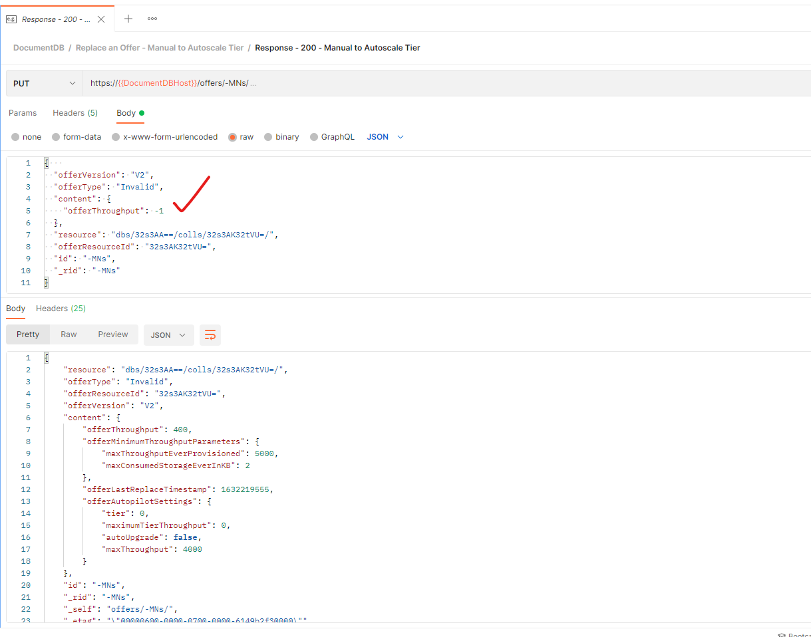

# Microsoft Azure Cosmos DB REST APIs Postman Guide
This white paper is a step-by-step guidance for setting up and testing Azure Cosmos DB Core SQL API resources using REST APIs with [Postman](https://www.postman.com/product/what-is-postman/) API platform.


**Summary:**

This document provides guidance on how to setup Postman for testing and working with Azure Cosmos DB resources using REST APIs.

**Version History:**

| **Name** | **Title** | **Notes** | **Date** |
| --- | --- | --- | --- |
| [Subhasish Ghosh](https://www.linkedin.com/in/sghosh2011/) | Cloud Solution Architect – Data &amp; AI, <br/> Microsoft EC-US, Global CSU | Original | 20 Sept 2021 |
| [Sajeetharan Sinnathurai](https://www.linkedin.com/in/sajeetharan/) | Senior Program Manager, Azure Cosmos DB <br/> Microsoft | Pre-request Script </br> [Offers](https://docs.microsoft.com/en-us/rest/api/cosmos-db/offers) REST API Ops | 21 Sept 2021 |
| [Subhasish Ghosh](https://www.linkedin.com/in/sghosh2011/) | | Added 2 new HTTP Status 400 scnenarios | 23 Sept 2021 |

# Contents

[Introduction](#Introduction)

[Creating an Azure Cosmos DB Account](#creating-an-azure-cosmos-db-account) 

[Setting up Postman](#setting-up-postman)

[Testing Cosmos DB REST APIs](#testing-cosmos-db-rest-apis)

[HTTP Status Codes](#http-status-codes)

[Troubleshooting Common Errors](#troubleshooting-common-errors)

[Conclusion](#conclusion)

[Feedback](#feedback)

[License/Terms of Use](#license--terms-of-use)

## Introduction

Azure Cosmos DB is Microsoft's globally distributed multi-model database that supports the document, graph, and key-value data models. 

For an in-depth coverage of Azure Cosmos DB, you can visit the following links from Microsoft Official Documentation:
- An [introduction](https://docs.microsoft.com/en-us/azure/cosmos-db/introduction) to Azure Cosmos DB
- [Considerations](https://docs.microsoft.com/en-us/azure/cosmos-db/choose-api#considerations-when-choosing-an-api) when choosing an API in Azure Cosmos DB

Postman is an API platform for building and using APIs. 
- Why use Postman? Simply put, Postman simplifies each step of the API lifecycle and streamlines collaboration so you can create better APIs — faster.

Representational State Transfer (REST) APIs are service endpoints that support sets of HTTP operations (methods), which provide create, retrieve, update, or delete access to the service's resources. The Azure Cosmos DB REST API provides programmatic access to Azure Cosmos DB resources to create, query, and delete databases, document collections, and documents. To perform operations on Azure Cosmos DB resources, you send HTTPS requests with a supported method: GET, POST, PUT, or DELETE to an endpoint that targets a resource collection or a specific resource.
- Azure Cosmos DB: REST API Reference can be accessed [here](https://docs.microsoft.com/en-us/rest/api/cosmos-db/).

In short, which key Cosmos DB resources can be managed via REST APIs? 
- Databases
- Collections
- Documents
- Attachments
- Stored Procs
- UDFs
- Triggers
- Users
- Permissions
- Offers

## Creating an Azure Cosmos DB Account

Follow this [quickstart](https://docs.microsoft.com/en-us/azure/cosmos-db/sql/create-cosmosdb-resources-portal) to use the Azure portal to create an Azure Cosmos DB SQL API account. Once done, please note down the following key items which we will need in Postman:

Go to Keys > "Read-write Keys" and note:
- [URI](https://docs.microsoft.com/en-us/rest/api/cosmos-db/cosmosdb-resource-uri-syntax-for-rest)
- [PRIMARY KEY](https://docs.microsoft.com/en-us/azure/cosmos-db/database-security?tabs=sql-api#primary-keys)

E.g from my account, I have noted down the 2 following items:


## Setting up Postman

If you have an operational Postman account already, simply [login](https://identity.getpostman.com/login). Otherwise, create an account and login. Once done, click on 'Workspaces' and create a new Workspace using "+ New Workspace". Example, I have created a workspace called, "My Workspace". Enter your specific workspace and then click on the 'Environments' tab.


We need to setup Environment Variables which will be applicable for next steps when we are working with Azure Cosmos DB resources via REST APIs. So here you need to setup 4 key parameters, 2 of which you will need to fill-in manually, and 2 of which will be done later programmatically via Script.

Let us understand these parameters and the significance that each plays:

- **DocumentDBMasterKey**: The master key token is the *all access* key token that allows users to have full control of Cosmos DB resources in a particular account. The master key is created during the creation of the account; there are 2 sets of keys: primary key & secondary key. Copy PRIMARY KEY from Azure portal, and paste the value in Postman Environment variable (as shown in image below). Please ensure you paste it under the column heading 'CURRENT VALUE' and **not** 'INITIAL VALUE'. Leave 'INITIAL VALUE' as it is.

- **DocumentDBHost**: This is a part of the URL without the leading "https://". So extract the remaining from Azure portal, and paste the value here (as shown in image below). Please ensure you paste it under the column heading 'CURRENT VALUE' and **not** 'INITIAL VALUE'. Leave 'INITIAL VALUE' as it is.

- **RFC1123time**: All REST operations, whether you're using a master key token or resource token, must include the authorization header with the authorization string in order to interact with a resource. The Date portion of the string is the UTC date and time the message was sent (in "HTTP-date" format as defined by RFC 7231 Date/Time Formats), for example, Tue, 01 Nov 1994 08:12:31 GMT. In C#, it can be obtained by using the "R" format specifier on the DateTime.UtcNow value. This same date(in same format) also needs to be passed as x-ms-date header in the request. Please visit Microsoft documentation link [here](https://docs.microsoft.com/en-us/rest/api/cosmos-db/access-control-on-cosmosdb-resources#authorization-header) to read further on how the the hashed token signature for a master token is contructured. We shall be contructing this programmatically later on. For the time-being, leave it empty.

- **authToken**: We shall be contructing this programmatically later on via a pre-request script to compose the auth token. For the time-being, leave it empty.

Once done, ensure you click on 'Save' on top right-hand corner, and exit.


Next, click on 'Collections' tab. You can add a new collection by clicking on '+ Create New Collection'. E.g. I had created a collection called 'DocumentDB'. Once created, you need to ensure that we setup 2 key parameters at the Collection-level.

- **Authorization**: Click on Type drop-down, and select, 'API Key'.

- **Pre-request Script**: In Pre-request Script box, you will need to copy and paste the following code shared below. This script executes before every request in this collection. You can setup at every request level, but it is not recommended; the best practice would be to ensure its set at collection level.

 ```
 // store our master key for documentdb
var mastKey = postman.getEnvironmentVariable("DocumentDBMasterKey");
console.log("mastKey = " + mastKey);

// store our date as RFC1123 format for the request
var today = new Date();
var UTCstring = today.toUTCString();
postman.setEnvironmentVariable("RFC1123time", UTCstring);

// Grab the request url
var url = request.url.trim(); 
console.log("request url = " + url);

// strip the url of the hostname up and leading slash
var strippedurl = url.replace(new RegExp('^https?://[^/]+/'),'/');
console.log ("stripped Url = " + strippedurl);

// push the parts down into an array so we can determine if the call is on a specific item
// or if it is on a resource (odd would mean a resource, even would mean an item)
var strippedparts = strippedurl.split("/");
var truestrippedcount = (strippedparts.length - 1);
console.log(truestrippedcount);

// define resourceId/Type now so we can assign based on the amount of levels
var resourceId = "";
var resType = "";

// its odd (resource request)
if (truestrippedcount % 2)
{
    console.log("odd");
    // assign resource type to the last part we found.
    resType = strippedparts[truestrippedcount];
    console.log(resType);
    
    if (truestrippedcount > 1)
    {
        // now pull out the resource id by searching for the last slash and substringing to it.
        var lastPart = strippedurl.lastIndexOf("/");
        resourceId = strippedurl.substring(1,lastPart);
        console.log(resourceId);
    }
}
else // its even (item request on resource)
{
    console.log("even");
    // assign resource type to the part before the last we found (last is resource id)
    resType = strippedparts[truestrippedcount - 1];
    console.log("resType");
    // finally remove the leading slash which we used to find the resource if it was
    // only one level deep.
    strippedurl = strippedurl.substring(1);
    console.log("strippedurl");
    // assign our resourceId
    resourceId = strippedurl;
    console.log("resourceId");
}

// assign our verb
var verb = request.method.toLowerCase();

// assign our RFC 1123 date
var date = UTCstring.toLowerCase();

// parse our master key out as base64 encoding
var key = CryptoJS.enc.Base64.parse(mastKey);
console.log("key = " + key);

// build up the request text for the signature so can sign it along with the key
var text = (verb || "").toLowerCase() + "\n" + 
               (resType || "").toLowerCase() + "\n" + 
               (resourceId || "") + "\n" + 
               (date || "").toLowerCase() + "\n" + 
               "" + "\n";
console.log("text = " + text);

// create the signature from build up request text
var signature = CryptoJS.HmacSHA256(text, key);
console.log("sig = " + signature);

// back to base 64 bits
var base64Bits = CryptoJS.enc.Base64.stringify(signature);
console.log("base64bits = " + base64Bits);

// format our authentication token and URI encode it.
var MasterToken = "master";
var TokenVersion = "1.0";
auth = encodeURIComponent("type=" + MasterToken + "&ver=" + TokenVersion + "&sig=" + base64Bits);
console.log("auth = " + auth);

// set our auth token enviornmental variable.
postman.setEnvironmentVariable("authToken", auth);

```

In the code above, ensure you change:
var mastKey = postman.getEnvironmentVariable("**DocumentDBMasterKey**"); to whatever you have named your Cosmos DB MasterKey environment variable.
E.g. if you have called it, MyCosmosDBMasterKey, then your code should look like:
var mastKey = postman.getEnvironmentVariable("**MyCosmosDBMasterKey**");

Once done, ensure you click on save and exit. You should see "green buttons" next to 'Authorization' & 'Pre-request Script' parameters, as shown in image below.


Now, we're ready to create our REST API requests. 
If you've reached thus far in the Journey, awesome! Take a much well deserved Coffee Break. 


## Testing Cosmos DB REST APIs

Before we deep-dive into a few of them, here's the [complete list of Common Tasks](https://docs.microsoft.com/en-us/rest/api/cosmos-db/common-tasks-using-the-cosmosdb-rest-api) using Azure Cosmos DB REST APIs from Microsoft documentation site. Request you to go through it to get a 50,000 feet level overview of what are the most commonly performed tasks using REST operations. In total, you can do following **53 operations** in Azure Cosmos DB (as of writing):

| **Resource** | **Common Operation** | **Number of Ops** |
| --- | --- | --- |
| **Databases** | Create, List, Get, Delete, Query | 5 |
| **Documents** | Create, List, Get, Replace, Delete, Query | 6 |
| **Collections** | Create, List, Get, Delete, Get Partition Key Ranges, Query | 6 |
| **Attachments** | Create, List, Get, Delete, Query | 5 |
| **Stored Procedure** | Create, List, Delete, Execute, Query | 5 |
| **UDFs** | Create, Replace, List, Delete, Query | 5 |
| **Triggers** | Create, Replace, List, Delete, Query | 5 |
| **Users** | Create, List, Get, Replace, Delete, Query | 6 |
| **Permissions** | Create, List, Get, Replace, Delete, Query | 6 |
| **Offers** | Get, List, Replace, Query | 4 |

Here's a few which I have from my Postman account (see image below). There's 2 **best practices** that I wish to highlight here:


1) Capture the response from the REST API call and save it with a 'Response 200 OK' when it works fine, or with a corresponding Error Code so that you can track it later. You can find the full list of all HTTP Status Codes [here](#http-status-codes). 

2) Capture all HTTP Status Codes as you work through a progression. E.g. in List Users GET operation, I checked whether working with when I had no users, and then I created a user with POST operation, after which I again captured Status Code for one user called "a_user" and then I created a user called "abhijit_user" for which I again captured the GET status code and saved it as 'Response 200 - OK - 2 users'. This gives a lineage to your operations and in case one particular REST API call fails, and you are sharing a Workspace with other developers/users, they can trace the ChangeLog and also see the specific Operations that failed OR resulted in a failed HTTP Status Code.

Let's now see a few ops in action and I will explain the key concepts as well in effectively using Postman in the walk-through of using an API.

### List Databases
This is a GET operation, wherein you type in Request URI in format: http://{{DocumentDBHost}}/dbs. You will need to ensure that your specific Environment Options are chosen correctly, and also once written, before firing the API, hover your mouse pointer on top of the variable. It should showcase in green the correctly set variable values. In case it does not, then it is any one of 3 possibilities: 1) you have either not correctly set the environment variable values, 2) you had correctly set in the past, but they have got overwritten for some reason, 3) you have not chosen the correct environment from the top-right-hand environment drop-down list. Always check these parameters to troubleshoot. If you have set correctly, it should showcase as below in green:


Before you click on "Send" button, there'a few other things to check which are super-critical. Click on Headers (see image below). For a detailed understanding of different Header values, you can consult Microsoft official documentation [here](https://docs.microsoft.com/en-us/rest/api/cosmos-db/common-cosmosdb-rest-request-headers). **This is an extremely important section and do not hurry in reading through it since incorrect values in Headers will result in failed REST API calls. Within the Header values, a few are 'Required', and rest are 'Optional'. You will need to understand the critical 'Required' values for every REST API operation that you wish to undertake.** 

Let us go to our specific example:


In the image above, as you can see, there's 11 Headers. Headers can be "auto-generated" which are added on the fly, or you can mention your own specifically, which then replaces the 'auto-generated' ones. E.g. you can see 2 **Accept** header values. The auto-generated one is "/" but I have replaced it with my own "application/json". 

A few other important ones which are required and important include:

- **Authorization**: paste {{authToken}} whose value will be generated by pre-request script on the fly. This represents the authorization token for the request.

- **x-ms-version**: This represents the version of the Cosmos DB REST service. For a list of supported API versions, see the list of [Supported Azure Cosmos DB REST API versions](https://docs.microsoft.com/en-us/rest/api/cosmos-db/#supported-rest-api-versions). I have used 2016-07-11 in my examples.

- **x-ms-date**: This represents the date for execution. Paste {{RFC1123time}} as the value for this, as this is also generated on the fly using pre-request script.

If you hover your mouse-pointer over {{authToken}} and {{RFC1123time}}, you shall see they do not have any values set. Do not worry, since the values will be generated and set on the fly. 

Now ensure all is saved and finally, click on the **SEND** button. If you have come thus far, and all values are set correctly, you shall see an output as shown in the image below. Click on the 'Save Response' button and you can save the response with an appropriate name; e.g. in my case, I save Status 200 with "Response 200 OK".


Before you move on, here's 5 things you should explore:

1. Hover your mouse-pointer over {{authToken}} and {{RFC1123time}}. You shall see that both now have values generated. Do not tinker with them.

2. On Body, you can click on Pretty, Raw, Preview options to check the output.

3. Check the time & size of the output parameters. 

4. At the bottom of the screen, you shall see the **Console** which you can pull up and deep dive into timestamps for the operation as it plays out. For example, if you wish to deep dive into Network headers, Request headers, Reponse headers, you can do so. E.g. for my GET operation, I have the output as shown in image below.


Since we're currently performing a 'List Databases' in an Azure Cosmos DB account, you should refer to the official documentation which explains **Response** [Body](https://docs.microsoft.com/en-us/rest/api/cosmos-db/list-databases#body-1) in granular detail with an example. In my case, I have received:

```
{
    "_rid": "",
    "Databases": [
        {
            "id": "FamilyDatabase",
            "_etag": "\"08008706-0000-0700-0000-5f6c45840000\"",
            "_rid": "32s3AA==",
            "_self": "dbs/32s3AA==/",
            "_colls": "colls/",
            "_users": "users/",
            "_ts": 1600931204
        }
    ],
    "_count": 1
}
```
wherein:
- _rid: system generated property. The value is empty for this operation.
- id: The unique user generated name for the database.
and others which you read more from [here](https://docs.microsoft.com/en-us/rest/api/cosmos-db/list-databases#body-1).

Let us see one more example with a POST operation.

### Create a Document within a Collection within a Database within an Account
This is a POST operation, wherein you type in Request URI in format: https://{{DocumentDBHost}}/dbs/FamilyDatabase/colls/FamilyContainer/docs. You will need to ensure that your specific Environment Options are chosen correctly, and also once written, before firing the API, hover your mouse pointer on top of the variable. It should showcase in green the correctly set variable values. In my example, I wanted to create a 'Steve Jobs' family document within FamilyContainer within FamilyDatabase database. See the image below for inputting the correctly formatted JSON in the Body of the POST ops.


Before you click on the **SEND** button, you need to ensure your Headers are set correctly as well. E.g. for creating a Document, if you fire the API call without mentioning the Partition Key for your collection, it will fail. You will need to set:

- **x-ms-documentdb-partitionkey**: this will be in the format, ["whateverisyourpartitionkey"]. E.g. in my collection, /LastName is the Partition Key. So I have put ["Jobs"] in my example. Common errors that you can do include:
1. Not providing x-ms-documentdb-partitionkey. API call will fail.
2. Keeping x-ms-documentdb-partitionkey blank. API call will fail.
3. Keeping x-ms-documentdb-partitionkey within quotes only. E.g. "Jobs" is incorrect.
4. Pasting your PartitionKey. E.g. "LastName" OR "/LastName" is incorrect. 
5. It has to the **value of the PartitionKey**. Hence, ["Jobs"] is correct. So from my example, here's the correct setting:


**TIP**: In case you have forgotten OR do not remember the PartitionKey value for your database, you can use the GET ops of ['List Collections'](https://docs.microsoft.com/en-us/rest/api/cosmos-db/list-collections) to check the PartitionKey value. E.g for my example, it is as shown below.


Before we move ahead, let us explore another excellent feature in Postman. It provides you within the GUI the corresponding Code Snippet for a given REST API call that you have fired in a programming language of your choice as a Developer. You can directly copy it from therein, and embed in your application. E.g. I have fired a creating a new document (called Ghosh Family) in my collection. After REST API call executes successfully, you can click on the </> icon on the right hand side, and it opens up the **Code snippet** area wherein you can select the programming language of choice from the drop-down. I have chosen C# and as you can see in the image below, I have the corresponding code generated which I can copy from here and paste to create a New Client-end (facing) .NET application (Web or Console) in Visual Studio.


### Offers

The offer resource is represented by offers in the Cosmos DB resource model. Here’s an example of the URI: https://mydbaccount.documents.azure.com/offers. One of the interesting and very useful operations that you can do via [Replace an Offer](https://docs.microsoft.com/en-us/rest/api/cosmos-db/replace-an-offer) is changing (scaling UP or DOWN) RUs (throughput) and also changing an existing Azure Cosmos DB Manual throughput (set to a specific RU) to Autoscale Tier, and vice-versa (i.e. back from Autoscale Tier to Manual throughput RU). Before you execute the get an offer, list offers, query offers and eventually replace an existing offer, set your **Pre-request Script** to:

```
// Get the current date in UTCFormat and save it in parameter
var now = new Date().toUTCString(); 
pm.environment.set("utcDate", now); 

// I need these to generate a token
var verb = "<<put GET OR PUT based on operation>>"; 
var resourceType = "offers"; 
var resourceId = "<<put here _rid_offer>>"; 
var text = (verb || "").toLowerCase() + "\n" + (resourceType || "").toLowerCase() + "\n" + (resourceId || "").toLowerCase() + "\n" + now.toLowerCase() + "\n" + "" + "\n"; 
console.log(text);

//Hash and Encode by using the masterkey.
var key = CryptoJS.enc.Base64.parse(pm.variables.get("DocumentDBMasterKey")); 
var signature = CryptoJS.HmacSHA256(text, key).toString(CryptoJS.enc.Base64); 
var MasterToken = "master"; 
var TokenVersion = "1.0"; 
var authToken = encodeURIComponent("type=" + MasterToken + "&ver=" + TokenVersion + "&sig=" + signature);

// Save it to parameter to use in HTTP header
pm.environment.set("authToken", authToken);

```
In the above code snippet, ensure you edit and change 3 things:
- verb should be set to operation type you wish to perform (PUT or GET etc.)
- resourceId should be set to "rid-offer" value which is a system-generated resource ID of the offer. Please see [documentation here](https://docs.microsoft.com/en-us/rest/api/cosmos-db/replace-an-offer) to find out your own database's rid-offer.
- when performing hash & encoding, you need to replace MasterKey name with whatever you have called it. E.g. in my case, it is 'DocumentDBMasterKey'.

Get an Offer: To retrieve an offer resource, perform a GET on the Offer resource.


List Offers: To list the offers under the database account, perform a GET on the offers resource, that is, the offers URI path.


In Replace an Offer, you can either choose to scale UP or DOWN manual throughput, OR alternatively, migrate an offer from **'manual throughput'** to **'autoscale'** and vice-versa.
1. Increased Manual throughput from 400 RUs to 5000 RUs 


2. Decreased Manual throughput from 5000 RUs to 600 RUs 


3. Change from 'Autoscale Tier' to Manual RU


4. Change from Manual RU to 'Autoscale Tier'


In this HOWTO I have only covered 5 REST APIs, but you can use the guidance for setting up other REST API requests for Azure Cosmos DB and try it out yourself! Have fun.


## HTTP Status Codes
Microsoft maintains a comprehensive list of all HTTP Status codes returned by the REST operations. You can access it [here](https://docs.microsoft.com/en-us/rest/api/cosmos-db/http-status-codes-for-cosmosdb). Here's some common Error/Status Codes and reasons that you could encounter:

- **400: Bad Request**. You should focus on the JSON/SQL/Jscript in the request body. An extra brace OR semi-colon OR closing bracket missing will result in 400 in most cases. 


- **401: Unauthorized**: 401 is returned when the Authorization header is invalid for the requested resource.


- **400: Bad Request**: I have a FamilyContainer (ID) in FamilyDatabase (Database) which is in 4000 (Max throughput) in Autoscale Tier. But I tried scaling UP to 40,000 RUs using Manual Scale-up REST API call. It will fail giving an Error 400. In other words, you cannot scale UP or DOWN via Manual REST API call if collection/db is set to Autoscale.


- **400: Bad Request**: I have a FamilyContainer (ID) in FamilyDatabase (Database) which is in 4000 (Max throughput) in Autoscale Tier. I fired a scale UP of 80,000 from 40,000 which went through, but within 1 second, I again fired another 40,000 RUs scale UP. It will fail giving an Error 400. In other words, you will need to give time for the 1st scale UP operation to complete before firing another scale UP or DOWN. 
- 

## Troubleshooting Common Errors
Postman provides a very stable environment for testing your REST APIs. If you're encountering errors, here's a CHECK LIST to check one by one:

1. Ensure your environment Variables are set.
2. Ensure pre-request script is set.
3. Ensure pre-request script variable values are correctly set.
4. Ensure you have saved the environment variables.
5. Ensure you have correctly set the pre-request script at 'Collection' level so that you do not have to set it individually every time for every request that you create.
6. Ensure you're correctly using the GET, PUT and POST operation as per documentation. Example in 'Offers', Get is a GET, List is a GET, replace is a PUT and Query is a POST.
7. Ensure you're correctly using the REQUIRED Headers. I once spent an entire night trying to troubleshoot a particular REST API which was failing and tinkered a 1000 places ony to find that one of the REQUIRED Headers is incorrectly set. So check, double-check and triple-check Headers values.
8. In POST ops, check the format of JSON in Body. If incorrect, it will result in a 400 Error.
9. If you receive a CORS Error after execution, then go to window bottom right-hand corner and click on 'Select Postman Agent', deselect 'Auto-select' and then click on Desktop Agent.


## Conclusion
This HOWTO explores the steps for setting up and leveraging Postman API platform for performing operations on Microsoft's Azure Cosmos DB resources using REST APIs. The Azure Cosmos DB REST API provides programmatic access to Azure Cosmos DB resources to create, query, and delete databases, document collections, and documents. To perform operations on Azure Cosmos DB resources, you send HTTPS requests with a supported method: GET, POST, PUT, or DELETE to an endpoint that targets a resource collection or a specific resource. You are encouraged to explore all the Ops using Postman and provide feedback, if any.

## Feedback
You can share any feedback at: sugh AT microsoft dot com

## License & Terms of Use

This is a free white paper released into the public domain.
Anyone is free to use or distribute this white paper, for any purpose, commercial or non-commercial, and by any means.

THE WHITE PAPER IS PROVIDED "AS IS", WITHOUT WARRANTY OF ANY KIND, EXPRESS OR IMPLIED, INCLUDING BUT NOT LIMITED TO THE WARRANTIES OF MERCHANTABILITY, FITNESS FOR A PARTICULAR PURPOSE AND NONINFRINGEMENT.

IN NO EVENT SHALL THE AUTHORS BE LIABLE FOR ANY CLAIM, DAMAGES OR OTHER LIABILITY, WHETHER IN AN ACTION OF CONTRACT, TORT OR OTHERWISE, ARISING FROM, OUT OF OR IN CONNECTION WITH THE WHITE PAPER.
